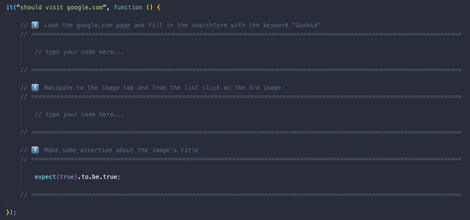

# 🦄 QA code challenge

> Hello.
>
> This is a sample project, which we send you in advance of your interview. This project's sole purpose is to let you prepare for the live technical code challenge what we expect you to do during the interview. Please feel free to read this document and try yourself with the sample test. The goal is to have an up and running dev environment already for the interview and to let you focus on the challenge itself, rather than getting familiar with this project's structure. This might require 10 minutes of your life. 🧬
>
> Live long and prosper

## Description
This project contains technical code challenge for QA Engineer interview. The code challenge's solution can be implemented either in `Protractor` or `Cypress` or `Playwright`.

The files and folders are structured already and the `spec` files already contain skeleton code with **fill-in areas** (marked with `// type your code here...`), where the challenge's solution is expected to be filled in.



Each exercise/question has a difficulty level marker from the following list: 1️⃣ | 2️⃣ | 3️⃣ | 4️⃣ 
✨ Tricky or extra (harder) questions are marked with this symbol.

While providing implementations, please fill in the right place in the code (or at least try).

```js
// 1️⃣  Login with the credentials
// ====================================

    // type your code here...

// ====================================
```

```js
// 1️⃣  Login with the credentials
// ====================================

    mycode.doSomeLoginMagic();

// ====================================
```

## Time limit

The interview itself is about 2 hours long. For the live coding challenge of it, you have 1 hour to solve.

## Methodology

For this code challenge you would be asked to **share your screen**, and **using your favourite IDE** go through the tasks and **give a solution for every question** .
Since the time limit is quite short, please try to convey your way of thinking as best as you can, thinking out loud can help the interviewers understand your reasoning and might help avoiding silly mistakes.
Please think about it as it a pair programming exercise, where you are the driver and the interviewer is the "phantom" navigator.

## Hint

You might want to check the `shared/api.ts` file, as during the interview you might need to use it for the ✨ trickier task. ;)

## Agenda of the technical interview

- Short introduction
- Discussion about CV and past experience
- Live coding challenge (like this)
- Another technical questions
- Your questions (if you have)

## Prerequisites

- install NodeJs latest LTS version
- `npm ci` to install the project dependencies

## Commands (depending on your preferences)

- run tests in cypress: `npm run cypress`
- run tests in protractor: `npm run protractor`
